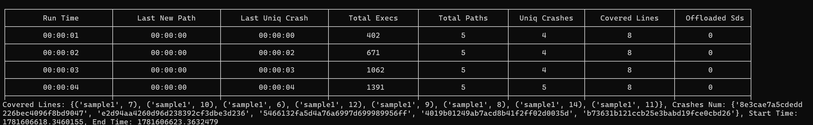

# PJ2 - 模糊测试（Fuzzing）实验报告

## 一、实验信息

- 课程名称：软件质量保障与测试
- 实验名称：模糊测试（Fuzzing）
- 实验类型：课程项目
- 小组成员：<u>  许颖忱、王锋奇、张梓榆、官海峰、孙讯讯  </u>
- 完成日期：<u>  2026-06-17  </u>

**具体分工**
 - 变异器模块负责人：王锋奇
 - Fuzzer 模块负责人：张梓榆
 - Schedule 模块负责人：孙讯讯
 - 持久化/框架改进负责人：官海峰
 - Samples 模块负责人：许颖忱
 - 集成测试负责人：许颖忱
 - 报告负责人：各模块的报告由各自负责人撰写，许颖忱汇总

## 二、实验目的

本实验旨在基于给定的简易 fuzzing 框架，完成输入变异、seed 调度、覆盖率反馈与结果持久化等关键能力，理解灰盒模糊测试的基本流程，并在此基础上形成一个可重复运行、可观察、可分析的实验闭环。

## 三、项目理解

### 3.1 框架结构

项目主要由以下模块组成：

- `fuzzer`：控制 fuzz 循环、seed 选择与输入生成。
- `runner`：执行目标样例并返回运行结果与覆盖率。
- `schedule`：对不同 seed 进行能量分配或优先级判断，共实现了四种计算方法不同的规划器。
- `utils`：提供覆盖率追踪、种子封装、对象持久化与输入变异工具。
- `samples`：提供用于验证 fuzz 效果的示例程序。
- `tests`：针对框架本身的部分原件编写的单元测试，包含用于测试框架模块能否按预期工作的测试用例。

### 3.2 设计主线

实验设计分为两个部分，一个是测试框架，另一个是测试对象。

对于测试框架，运行方式如下：
1. 从 `corpus` 读取初始 seed。
2. `PowerSchedule.choose()` 调度器选择 seed。
3. `Mutator.mutate()` 执行变异。
4. `Runner` 执行器记录覆盖率，更新种子能量。
5. 若发现新覆盖或崩溃，则写入持久化存储。

对于测试对象，主要需要有以下实现：
1. 在 `samples/samples.py` 中添加被测试函数的定义。
2. 添加对应 corpus，写入初始种子。
3. 在主函数中注册 sample，使其能被通过命令行指定。

实现时，采用模块化设计，通过面向对象的设计模式使实现与接口解耦。例如，框架提供基类 `Fuzzer`、`Runner` 与 `PowerSchedule`。在实现项目时，需要从这些基类继承并重写具体实现方式。如此，使得项目成为一个可插拔的 Fuzzing 管线。同时，还需要兼顾项目的易用性，给出可靠的中间结果持久化，可读的结果输出等。在调用时，也需要给出丰富的 CLI 控制选项。

此外，为了保证分工各自实现的框架模块的可靠性，还要求所有模块实现者为自己所实现的功能模块提供单元测试，目录为 `tests`，并确保所有测试均能通过，以减轻最后集成测试时的调试负担。


## 四、实现内容

### 4.1 变异器实现

在原有 7 种变异策略基础上，新增 3 种策略，修复 2 个 Bug，并对字节级变异函数的编解码机制进行了修复性改进。最终 `Mutator` 类包含 **10 种**变异策略。

**文件变更**

| 文件 | 操作 | 操作人 | 说明 |
|------|------|------|------|
| `utils/mutator.py` | 完善 | 王锋奇 | 新增策略 + Bug 修复 |
| `tests/test_mutator.py` | 新建 | 王锋奇 | 63 项单元测试 |

---

**4.1.1 新增策略 — `delete_random_bytes` — 随机删除**

```
删除 N 个连续字节 (N = 1 ~ min(8, len-1))，缩短字符串长度。
删除后至少保留 1 字节，避免空字符串。
```

对应 AFL 策略: random havoc 中的 delete 操作

**4.1.2 新增策略 — `clone_random_bytes` — 随机克隆/重复**

```
从字符串中复制一段 N 字节 (N = 1 ~ min(8, len))，插入到随机位置。
100% 使用原文内容（与 havoc_random_insert 的 75%/25% 区分）。
```

对应 AFL 策略: random havoc 中的 clone 操作

**4.1.3 新增策略 — `overwrite_with_random_bytes` — 随机字节覆盖**

```
用随机字节（范围 0~255，含控制字符）覆盖 N 字节 (N = 1 ~ min(8, len))。
与 havoc_random_replace 区别：100% 使用随机字节，不复制原文。
```

对应 AFL 策略: random havoc 中的 overwrite 操作

---

同时，对两个有关越界或编码异常的错误进行针对性修复。

**4.1.4 Bug 修复 — 字节级操作的编解码修复**

问题: 原代码使用 `s.encode('utf-8')` + `data.decode('utf-8', errors='ignore')` 进行字节与字符串的转换。当位翻转/算术变异产生非法 UTF-8 字节序列时，`errors='ignore'` 会**静默丢弃**这些字节，导致：
- 数据意外丢失
- 变异后的字符串长度不可预测地缩短

修复方法: 引入 `_to_bytes()` / `_to_str()` 辅助函数，采用 latin-1 优先 + UTF-8 回退 的编解码策略：

```python
def _to_bytes(s: str) -> bytearray:
    try:
        return bytearray(s.encode('latin-1'))    # latin-1 无损: 256 字节 ↔ 256 字符
    except UnicodeEncodeError:
        return bytearray(s.encode('utf-8'))      # 非 latin-1 字符回退 UTF-8

def _to_str(data: bytearray) -> str:
    return data.decode('latin-1')                 # 始终成功，无数据丢失
```

补充说明: latin-1 编码保证每个字节 0-255 与一个 Unicode 字符 (U+0000-U+00FF) 一一对应，实现真正的无损往返。对含中文等非 latin-1 字符的输入，回退 UTF-8 编码后 latin-1 解码同样无数据丢失。

**4.1.5 Bug 修复 — `havoc_random_replace` 边界条件修复**

问题: 当 `replace_len == length` 时（替换长度等于字符串总长），无法从原文其他位置复制内容，原代码设定 `replace_bytes = bytearray()`（空），导致替换操作等价于删除——字节长度意外缩短。

修复: 当 `length - replace_len <= 0` 时，回退为生成随机字节替换，保持字节长度不变：

```python
if length - replace_len <= 0:
    replace_bytes = bytearray(random.randint(0x20, 0x7E) for _ in range(replace_len))
```

---

总结而言，目前的变异器具有以下策略，其具体参数以及适用范围如下表：

| # | 策略函数 | 类型 | 字节长度变化 | 适用场景 |
|---|----------|------|-------------|----------|
| 1 | `insert_random_character` | 单字符插入 | +1 | 仅插入单字符，提供温和、小幅度的的扰动 |
| 2 | `flip_random_bits` | 位翻转 | 不变 | 对数字测试整数溢出、符号位翻转、边界条件等，对于字符串而言测试垃圾字符的影响 |
| 3 | `arithmetic_random_bytes` | 算术变异 | 不变 | 数值字段边界探测 |
| 4 | `interesting_random_bytes` | 趣味值替换 | 不变 | 测试软件工程领域常用的惯用值或危险的特殊字符 |
| 5 | `havoc_random_insert` | 随机插入 | +insert_len | 相对于单字符更为激进的扰动，注入随机垃圾数据 |
| 6 | `havoc_random_replace` | 随机替换 | 不变 | 替换部分内容而不改变结构长度 |
| 7 | `random_block_swap` | 块交换 | 不变 | 打乱块顺序，用于测试顺序强相关的结构 |
| 8 | **`delete_random_bytes`** | **随机删除** | **-N** | 截断输入测试缺失数据时的异常处理 |
| 9 | **`clone_random_bytes`** | **随机克隆** | **+N** | 重复字段鲁棒性测试 |
| 10 | **`overwrite_with_random_bytes`** | **随机覆盖** | **不变** | 测试边界条件 |

这 10 种策略从以下方面保证了编译输入的多样性：
 - 同时覆盖了长度不变、长度增长、长度减小三种情况
 - 既有原文内容复制注入，又有随机垃圾内容注入
 - 变异器随机组合这些策略可以得到很大的变异空间


### 4.2 调度策略实现

灰盒模糊测试的核心反馈机制是策略引导：Fuzzer 优先变异那些具有更高重要性的种子，采样时以重要性为权重随机采样。重要性由调度策略给出，策略的重要性赋值逻辑应当尽量引导 Fuzzer 探索更多未覆盖的代码区域。

路径的定义：一次执行覆盖的代码行集合，即 `frozenset(seed.coverage)`——由若干 `(函数名, 行号)` 组成的不可变集合。不同的覆盖行集合代表不同的执行路径。

能量分配原则：路径触发频率越低，种子获得的能量越高，在后续调度中被选中变异的概率越大。

**文件变更**

| 文件 | 操作 | 操作人 | 说明 |
|------|------|------|------|
| `fuzzer/path_grey_box_fuzzer.py` | 完善 | 张梓榆 | 实现集成路径频率追踪的灰盒 Fuzzer |
| `schedule/path_power_schedule.py` | 完善 | 张梓榆 | 实现基于路径频率的能量调度策略 |
| `schedule/prob_weight_schedule.py` | 新建 | 孙讯讯 | 实现概率加权轮询调度策略 |
| `schedule/rare_line_power_schedule.py` | 新建 | 官海峰 | 实现基于罕见代码行的调度策略 |
| `schedule/size_power_schedule.py` | 新建 | 许颖忱 | 实现基于输入长度的调度策略 |
| `tests/test_*_schedule.py` | 新建 | 许颖忱 | 针对几种调度策略实现的单元测试 |

---

**4.2.1 Fuzzer 实现**

简单实现了 `PathGreyBoxFuzzer` 类，该类继承自 `GreyBoxFuzzer`，在其基础上新增路径频率追踪能力。每次执行目标函数后：
1. 从 Runner 获取本次执行的覆盖率（即路径）
2. 将路径 ID 反馈给调度器，更新全局路径频率表
3. 若发现新路径，记录发现时间和累计路径数

同时，在父类 5 列统计基础上新增 2 列：
 - Last New Path: 最后一次发现新路径的时间
 - Total Paths: 累计发现的唯一路径数

---

**4.2.2 完善策略 — `PathPowerSchedule` — 基于路径频率的能量调度策略**

对基类 `PowerSchedule` 进行了以下改动：
 - 移除了 `choose` 函数对 `MAX_SEEDS` 的特殊处理——目前 population 大小由 Fuzzer 处理，包括 population 过大时低能量 seed 的删除与卸载入硬盘等操作，使得该函数专注于采样

实现了 `PathPowerSchedule` 中的以下单元：
- `path_frequency`：字典，key 为路径标识（frozenset），value 为该路径被触发的累计次数
- `assign_energy`：为种群中每个 seed 计算能量，公式为 `energy = 1 / freq`，触发次数越多权重越小
  - 初始设计使用 `2^(1-freq)` 实现指数衰减，但在长时间运行中，高频路径的指数会溢出 Python 浮点数上限（`2^1024`），且低频路径能量趋近于 0 导致归一化断言失败。`1/freq` 简洁稳健，同样满足"与频率成反比"的语义

**4.2.3 新增策略 — `ProbabilityWeightedRoundRobinSchedule` — 概率加权轮询调度策略**

支持人工为 seed 赋予权重的加权概率采样调度策略。在测试者明知某些 seed 比其他的更为重要时，可以人工或程序化地赋予高权重以引导 Fuzzer 更高效地采样。

然而，在本项目中，并未为任何 seed 人工赋予权重，因此本策略在实际运行时退化为 uniform sampling，使得每个 seed 具有均等的概率被选中。因此，在这种情况下，本策略可以作为评估其他策略的 baseline 使用。

**4.2.4 新增策略 — `RareLinePowerSchedule` — 基于罕见代码行的调度策略**

整体实现类似于 `PathPowerSchedule`，但是计量粒度不同，以单条语句为能量计量单位而非整条路经，使得覆盖较少覆盖的代码行的 seed 能够获得更高权重，更容易被选中。公式依然为 `energy = 1 / freq`，然而 `freq` 逐行计算，最终能量为覆盖的每行的能量的累加。

**4.2.5 新增策略 — `SizePowerSchedule` — 基于输入长度的调度策略**

偏好较短输入的调度策略，公式为 `energy = 1 / size`，执行的用例往往更干净、干扰少，且执行快，在特定类型程序的测试中具有优势。

---

在此仅讨论理论优缺点，围绕实验结果的讨论与比较见第五部分。理论上，退化为均匀采样的概率加权轮询调度策略由于没有任何保证覆盖率的手段，因此理论上覆盖率与错误发现情况最差。路径频率与罕见行策略有针对覆盖率的引导，理论上能获得较好的覆盖率与问题发现能力，但是在较长程序上路径频率易出现权重涣散的情况，因此认为罕见行在长程序上表现最好，在短程序上二者相当。输入长度策略也没有覆盖率引导，因此覆盖效率不如以上两种策略高，但是优势在于能够输出更干净、简短的失败案例，有更好的人类可读性。

### 4.3 持久化与框架优化

长时间运行的 fuzzing 会话中，内存中的 seed 数量会持续增长，最终导致内存消耗过多。此外，框架还存在诸多不完善之处，可能影响运行体验。

**文件变更**

| 文件 | 操作 | 操作人 | 说明 |
|------|------|------|------|
| `fuzzer/grey_box_fuzzer.py` | 完善 | 官海峰、许颖忱 | 实现 seed 卸载/重载、中间结果持久化 |
| `fuzzer/path_grey_box_fuzzer.py` | 完善 | 官海峰 | 实现路径/行频率数据持久化 |
| `utils/coverage.py` | 优化 | 许颖忱 | 新增标准库过滤，减少覆盖率噪声 |
| `utils/object_utils.py` | 完善 | 官海峰 | 提供 pickle 序列化/反序列化工具 |

---

**4.3.1 Seed 内存管理与磁盘卸载**

当内存中 seed 数量超过阈值（`IN_MEMORY_SEED_LIMIT = 500`）时，将低能量 seed 持久化到磁盘；每隔一定轮数（`OFFLOAD_RELOAD_INTERVAL = 5000`）将磁盘上的 seed 重新加载回内存，让调度器重新评估它们，防止卸载变成永久删除。

卸载时，按能量升序排列，将超出阈值的低能量 seed 序列化为 pickle 文件存入 `persist/seeds/`，只保留高能量种子在内存中。维护 `_offloaded_index` 字典（`seed.md5 → 文件路径`），避免重复序列化同一 seed。每 5000 次调用触发 `_reload_offloaded_seeds()`，将磁盘上的所有 seed 重新加入内存 population，调度器可重新为其分配能量。

**4.3.2 中间结果持久化**

除 seed 外，以下中间数据也定期落盘，防止崩溃丢失：

| 数据 | 持久化时机 | 存储位置 |
|------|-----------|----------|
| 崩溃映射 `crash_map` | 每 1000 次执行 | `_result/persist/crashes/crash_map.pkl` |
| 路径频率表 `path_frequency` | 每 1000 次执行 | `_result/persist/path_frequency/path_frequency.pkl` |
| 行频率表 `line_frequency` | 每 1000 次执行 | `_result/persist/path_frequency/line_frequency.pkl` |
| 最终运行结果 `Result` | 会话结束时 | `_result/Sample-{n}-{schedule}.pkl` |

**4.3.3 其它框架优化**

标准库过滤：在 `utils/coverage.py` 中，新增了标准库路径过滤机制，过滤标准库内部的覆盖统计，但是为 `html.parser.HTMLParser` 类提供白名单。过滤后覆盖率仅包含被测目标函数及其调用的用户代码，使调度器的能量分配和覆盖率统计更加准确。

静默模式：`--quiet` 标志抑制每约 1 秒输出的实时统计表格，适合批量测试和自动化脚本。

新增示例程序：新增 Sample 5 数学表达式解析程序，以及 Sample 6 Brainfuck 解析器。Brainfuck，是一种极简的图灵完整程序语言，只有 `><+-.,[]` 六种操作符。这两个示例程序都由 LLM 编写，因此可靠性未知，值得暴力测试。

### 4.4 入口与运行方式

由于本项目没有依赖于外部包，因此未采用 `uv` 等包管理器。  
标准入口为 `main.py`，调用方式如下：
```bash
python main.py [--sample 1 | 2 | 3 | 4 | 5 | 6] [--schedule path | prob_weight | rare_line | size] [--run-time SECONDS]
```
典型输出如下：


此外，还提供了便利脚本 `_run_all.py`，用于快速执行 6 种 sample 以及 4 种调度策略交叉出的 24 种组合，并在 `_result/FULL_TEST_SUMMARY.txt` 生成格式可读、内容详实的报告。调用方式：
```bash
python _run_all.py
```

## 五、测试与结果

### 5.1 测试环境

系统：Windows 11 26H1
硬件：Intel Core i9-13980HX / 32GB DDR5 / NVIDIA RTX4070 Laptop
Python 版本：3.14.6
外部依赖：不依赖 Python 本体以外的包

### 5.2 测试设置

所有 6 个样本程序与 4 种调度策略交叉共 24 组测试，每组运行 10 秒，结果汇总如下。

- 测试样例：Sample 1-6
- 运行时间：每组合 10 秒
- 调度策略：path / prob_weight / rare_line / size
- Corpus：每个样本 1 个种子（Sample 1-4 为项目模板自带，Sample 5-6 为人工添加）

### 5.3 总体结果汇总

原始结果请见代码库根目录附加的 `FULL_TEST_SUMMARY.txt`，该报告由 `_run_all.py` 脚本生成，其中有详细的执行时间、错误对应的输入等原始数据。以下为原始结果的汇总、总结与分析。

| Sample | 程序类型 | LoC* | 覆盖数 | | | | 崩溃数 | | | | 最佳覆盖率 |
|--------|----------|:---:|:------------------:|:----------:|:-----------------:|:----------:|:------------------:|:-----------:|:-----------------:|:-----------:|:----------:|
| | | | prob_weight | path | rare_line | size | prob_weight | path | rare_line | size | |
| 1 | 数值运算 | 9 | **8** | **8** | **8** | **8** | 5 | 5 | 5 | 4 | 88.9% |
| 2 | 字符串格式化 | 13 | **13** | **13** | **13** | **13** | 4 | 4 | 4 | 3 | 100% |
| 3 | 嵌套分支 | 9 | 7 | **9** | **9** | **9** | 7 | 8 | 8 | 8 | 100% |
| 4 | HTML 解析 | — | 170 | **180** | 177 | 177 | 0 | 0 | 0 | 0 | — |
| 5 | 算术表达式 | 58 | **56** | **56** | **56** | **56** | 68 | 91 | 98 | 69 | 96.6% |
| 6 | Brainfuck | 48 | **48** | **48** | **48** | **48** | 4 | 4 | 4 | 4 | 100% |

*LoC：有效代码行数，统计范围为函数体内所有可执行语句行（含嵌套函数 `def` 行，不含函数签名、docstring 和空行）。Sample 4 因 HTMLParser 为标准库代码，内部实现复杂，难以统计总行数，故留空。

### 5.4 各样本分析

**Sample 1（简单数值运算）**：4 种策略均覆盖 8 行（88.9%）。对于模糊测试而言，浮点数的 `r1 == r2` 极难满足，因此均未覆盖到。假设要覆盖此行，则建议使用符号执行等白盒方法。size 策略缺失一类错误（`.1` 开头数字），因其偏好短输入而忽略了某些特定情况，而其余三种方法均发现 5 类崩溃（除数为零、负索引、非数字输入等）。

**Sample 2（字符串格式化）**：4 种策略均达到 100% 覆盖率。崩溃类型一致的 4 类，但 size 策略少发现 1 类（与 `-9.k` 开头的特定输入相关），原因同上为输入长度问题。

**Sample 3（嵌套分支 `FDU...LA`）**：除 prob_weight 以外的三种均达 100% 覆盖率，印证了上文中 prob_weight 均匀采样覆盖能力较差的推测。prob_weight 还少发现 1 类崩溃，原因在于没有覆盖率引导。

**Sample 4（HTML 解析器）**：path 策略覆盖行数最多（180 行），所有策略均未发现崩溃。可能是由于 HTMLParser 为标准库部分，本身鲁棒性高，变异输入不会导致异常。prob_weight 因无引导仅覆盖 170 行，path 策略以 180 行领先。

**Sample 5（算术表达式求值）**：所有策略均覆盖 56 行（96.6%）。该样本为 LLM vibe coding 编写，是所有样本中崩溃类型最丰富的样本，rare_line 以 98 类崩溃领先，path 策略 91 类次之，prob_weight 和 size 表现则较差。rare_line 在复杂程序上与 path 相比具有优势，印证了上文的猜想，此样本中各个策略的表现与上文理论推演几乎完全一致。

**Sample 6（Brainfuck 解释器）**：4 种策略均达 100% 覆盖率，覆盖率与崩溃表现均完全一致。BF 仅有 6 种有效操作符，解释器实现起来非常简单，虽然为 LLM 实现但鲁棒性尚可，崩溃类型可控，因此难以体现特定策略的优势。

整体来看，path 和 rare_line 是表现最稳定的两种策略，rare_line 在 Sample 5 这类复杂程序上优势明显。size 与 prob_weight 缺乏覆盖率引导，常常遗漏特定的崩溃类型。

### 5.5 有趣的发现

- **`HTMLParser` 的行为差异**：最终测试基于 Python 3.14.6，此时 `HTMLParser` 展现出了高度健壮性零异常。但是由于某次测试时组员不慎使用了 Python 3.12.3，发现该版本下会抛出一种崩溃类型，这说明 Python 标准库随版本升级，鲁棒性也在不断进步。
- **Sample 5 极高的独特崩溃种类**：该程序由 LLM 生成且未测试，包含大量边界条件缺陷，证实了 LLM 生成的代码仍需要充分验证后才能在严肃场景下使用，同时也证明了 fuzzing 对 LLM 生成代码的验证能力。
- **时间预算与结果的关系**：一开始测试时给的时间预算其实远长于 10s，但发现不同调度策略之间结果趋同，无法有效展现差异。因此把时间缩短到了 10s，在该预算下部分样本能体现策略差异，但是较为简单的几个样本仍然结果非常趋同。

## 六、总结与反思

本项目通过分工协作，实现了一套完整可运行的 fuzzing 流程框架。在实现框架本身的功能时，还使用了过去所学的单元测试技术对每个单元进行质量保障，保证分工实现的效率，避免集成测试时爆发重大缺陷。经过本项目的练习，组员们不仅复习了过去学过的单元与集成测试，还掌握了 Fuzzing 的主要原理与实现技巧。

在整个实现过程中，最难的部分是集成测试。由于分工，不同组员提交代码具有顺序，导致某些模块可能未能兼容另一些模块，因此在集成测试时就会产生问题。为此，需要经常要求特定模块的负责人进行返工修缮，最后才使得整个系统具有较稳定的运行能力。
